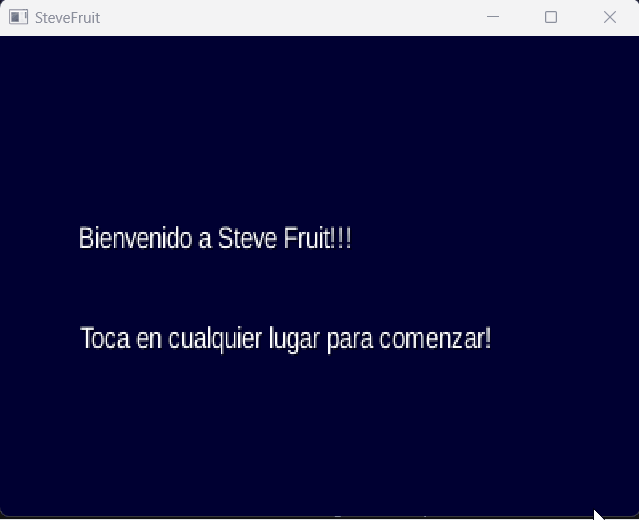
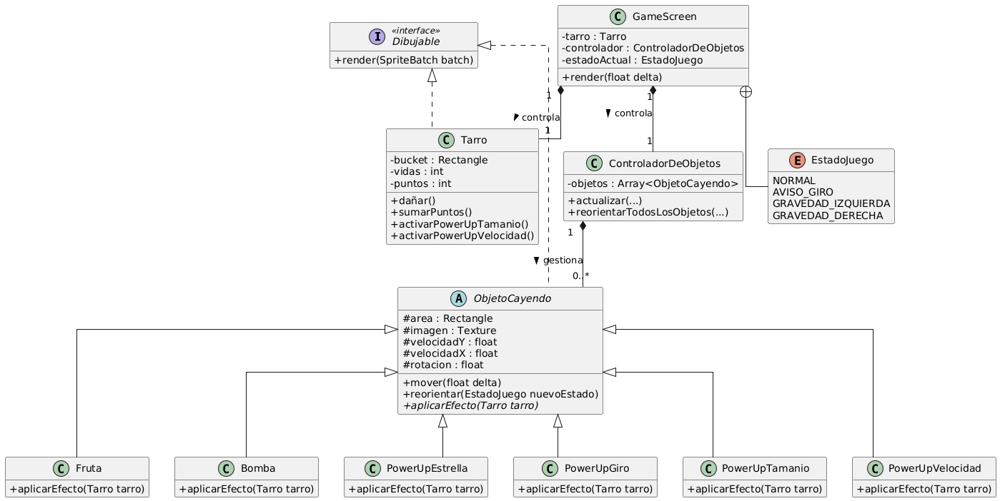

# Proyecto Videojuego (GM) - Lluvia de Crafteo

Juego 2D del tipo "object catcher" desarrollado en Java con el framework LibGDX usando como base el proyecto GameLluvia. El proyecto cumple con los requisitos del avance del GM, aplicando principios de diseño orientado a objetos y patrones de software. La temática visual y sonora está inspirada en Minecraft.

## GM1.1: Descripción Funcional del Juego

**Objetivo:** Controlar un personaje (Steve) para recolectar objetos "buenos" que caen, mientras se esquivan objetos "malos" y se aprovechan power-ups que alteran la jugabilidad.

**Elementos Principales:**
*   **Jugador:** Se controla un caldero de Minecraft que lo sostiene Steve.
*   **Objetos a Recolectar:** Manzana y Sandía. Suman puntos.
*   **Obstáculos:** TNT. Resta una vida al contacto.
*   **Power-ups:**
    *   **Estrella del Nether:** Otorga puntos extra y una vida adicional.
    *   **Poción de Tamaño:** Aumenta el tamaño del jugador temporalmente.
    *   **Poción de Velocidad:** Aumenta la velocidad de movimiento del jugador temporalmente.
    *   **Perla de Ender:** Activa el modo "Giro de Gravedad", donde los objetos caen de los lados y los controles cambian a un eje vertical.

**Controles:**
*   **Modo Normal:** Flechas Izquierda/Derecha o A/D.
*   **Modo Giro de Gravedad:** Flechas Arriba/Abajo o W/S.

## GM1.2: Análisis Técnico y Diseño de Software

La arquitectura del proyecto se basa utilizando la clase `Game` de LibGDX para gestionar diferentes `Screen` (pantallas) que representan los estados del juego (menú, partida, game over).

A continuación, se detalla cómo se cumplieron los requisitos de diseño:

**GM1.4: Clase Abstracta**
*   Se implementó una clase `public abstract class ObjetoCayendo` para centralizar el comportamiento común de todos los objetos que caen (posición, velocidad, movimiento y renderizado base).
*   Clases concretas como `Fruta`, `Bomba` y los distintos `PowerUp` heredan de esta y especializan el método abstracto `aplicarEfecto()`, aplicando el polimorfismo para definir su interacción única con el jugador.

**GM1.5: Interfaz**
*   Se definió una `public interface Dibujable` con un único método `render(SpriteBatch batch)`.
*   Las clases `Tarro` y `ObjetoCayendo` implementan esta interfaz, lo que obliga a que todos los elementos renderizables del juego tengan un método de dibujado estandarizado. Esto desacopla la lógica de renderizado de la clase `GameScreen`.

**GM1.6: Encapsulamiento y Principios OO**
*   Todos los atributos de las clases de dominio se declaran como `private` o `protected`. El acceso y la modificación del estado interno de los objetos (ej. vidas del jugador, temporizadores de power-ups) se gestionan a través de métodos públicos, protegiendo su consistencia.
*   El diseño es un ejemplo práctico del **Principio Abierto/Cerrado (SOLID)**. Para añadir los power-ups de Tamaño y Velocidad, solo fue necesario crear sus respectivas clases que heredan de `ObjetoCayendo` y actualizar la lógica de creación en `ControladorDeObjetos`, sin modificar clases ya existentes como `GameScreen` o `Tarro`.

**Extras Implementados:**
*   **Manejo de Excepciones:** La carga de todos los assets en `GameScreen` está contenida en un bloque `try-catch` que captura `GdxRuntimeException`. Si un archivo no se encuentra, el juego no crashea, sino que registra un error en la consola y se cierra de forma controlada.

## GM1.3: Diagrama UML

## GM1.7: Control de Versiones

El código fuente del proyecto está versionado con Git. El historial de commits se encuentra en este repositorio de GitHub y sigue una estructura lógica, separando la implementación de la base, la refactorización a herencia/interfaces y la adición de nuevas funcionalidades en commits.